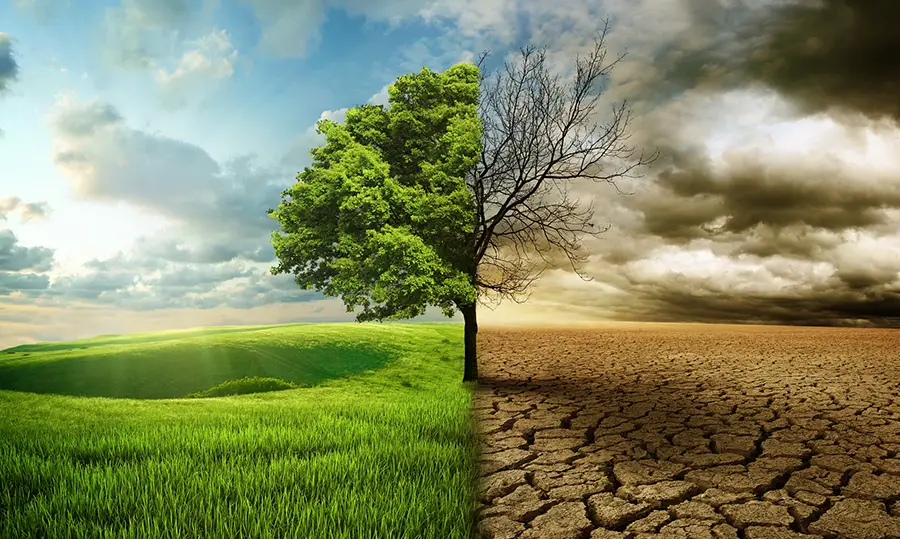
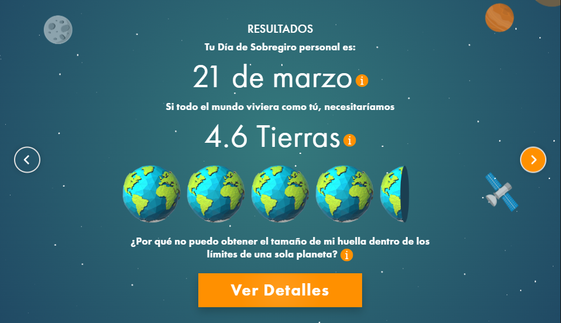
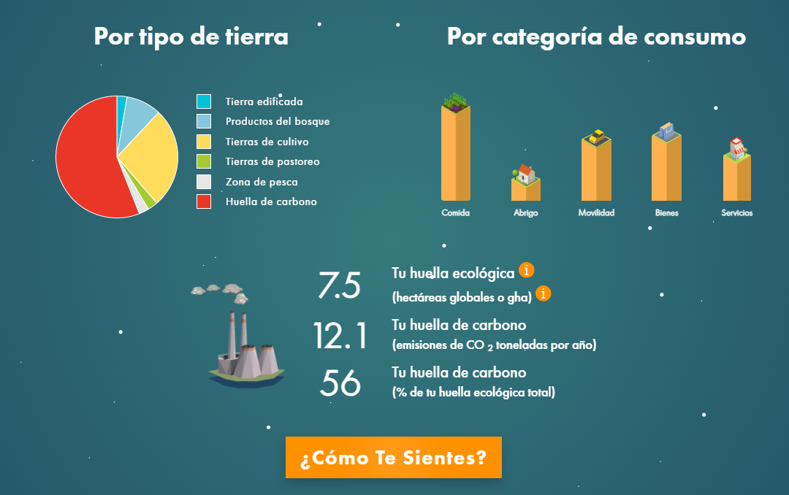

# Diario de sostenibilidad de Pedro Torres Fernández

---

## Diciembre

### 12/12/2025
**Tema:** Cambio climático
**Pregunta del día:** ¿Cual es el principal emisor de $\text{CO}_2$? y ¿Que sistemas que podemos construir para mitigar el cambio climático?

- Hoy con Miguel hemos visto el cambio climático, donde el cambio climático es un fenómeno que describe las alteraciones significativas y duraderas en los patrones climáticos del planeta. Aunque el clima siempre ha variado de manera natural, desde mediados del siglo XIX las actividades humanas han acelerado este proceso a un ritmo sin precedentes.

- Las principales causas de este cambio climático se debe a causas humanas como: Quema de combustibles fósiles (energía, transporte, industria), la Deforestación (la excesiva tala de arboles), la Agricultura intensiva y los Procesos industriales (cemento, acero, químicos).

- Además contamos con Los Gases de efecto invernadero, donde los principales gases de efecto invernadero son el dióxido de carbono (CO₂), el metano (CH₄), el óxido nitroso (N₂O) y los gases fluorados. El CO₂ es el gas más abundante, generado principalmente por la quema de combustibles fósiles. El metano proviene de la ganadería, los vertederos y la extracción de combustibles fósiles. El óxido nitroso está asociado al uso de fertilizantes agrícolas. Los gases fluorados se utilizan en procesos industriales y son muy potentes y persistentes.

- Y en cuanto a las preguntas del dia son: ¿Cual es el principal emisor de $\text{CO}_2$? y ¿Que sistemas que podemos construir para mitigar el cambio climático?

- El principal emirsor de $\text{CO}_2$ es la quema de combustibles fósiles para producir energía (electricidad y calor), Esta actividad por sí sola es la mayor fuente de CO₂ del planeta porque usamos electricidad para casi todo: iluminar, calentar, refrigerar, fabricar, mover máquinas, etc.

- Y en cuanto a los sistemas que podemos construir para mitigar el cambio climático tengo algunos ejemplos que serían: 

- A) Sistemas de energía renovable
    - Parques solares
    - Parques eólicos terrestres y marinos
    - Hidroeléctricas
    - Geotermia
    - Biomasa sostenible

- B) Sistemas de transporte sostenible
    - Vehículos eléctricos
    - Trenes eléctricos
    - Infraestructura ciclista
    - Transporte público eficiente

- C) Sistemas naturales de captura de carbono
    - Reforestación
    - Restauración de humedales
    - Conservación de suelos
    - Agricultura regenerativa

- D) Sistemas tecnológicos de captura de carbono
    - CCS (Captura y almacenamiento en origen)
    - DAC (Captura directa del aire)
    - Uso del CO₂ en procesos industriales

- E) Sistemas de eficiencia energética
    - Edificios inteligentes
    - Aislamiento térmico
    - Iluminación LED
    - Maquinaria industrial eficiente

- F) Sistemas económicos y políticos
    - Impuestos al carbono
    - Mercados de emisiones
    - Normativas ambientales

---

### 05/12/2025
**Tema:** Huella de carbono
**Pregunta del día:** Reflexión sobre los resultados de mi huella de carbono 

- Hoy con Miguel hemos visto la huella de carbono donde seria un indicador ambiental que reflaja la cantidad de gases de efecto invernadero.

Aunque hablamos de "carbono", esta huella incluye varios gases (como el metano, el óxido nitroso y los gases fluorados), pero se unifican bajo una sola unidad para poder compararlos:

- Se mide en masa de $\text{CO}_2$ equivalente ($\text{CO}_{2} \text{eq}$ o $\text{CO}_{2} \text{e}$).

- Esto significa que el efecto de calentamiento de todos los GEI se traduce a la cantidad de dióxido de carbono ($\text{CO}_2$) que causaría el mismo calentamiento.

La huella se puede aplicar a cualquier escala escala:

- Personal: El impacto de tus hábitos diarios (transporte, dieta, consumo de energía en casa).

- Productos: Las emisiones a lo largo de todo el ciclo de vida (desde la materia prima hasta el descarte o reciclaje).

- Organizacional/Empresarial: Las emisiones generadas por las actividades de una empresa en un periodo de tiempo.

Miguel nos ha propuesto calcular nuestra huella de carbono mediante una pagina web: 

El resultado es innegable y me golpea: necesito 4.6 Tierras. No es una cifra abstracta, es la medida de mi impacto insostenible. Vivo bajo una lógica de Economía Lineal que me obliga a consumir los recursos de todo un año antes del 21 de Marzo, mi personal Día de Sobregiro. El resto del tiempo, simplemente estoy agotando la capacidad de la Tierra.

El principal motor de este desequilibrio es mi Huella de Carbono, que representa el 56% de mi impacto total y suma 12.1 toneladas de $\text{CO}_{2} \text{e}$. Esto me señala directamente: mi Movilidad, mi Abrigo y la producción de los Bienes y Servicios que compro están atados a fuentes de energía de alta emisión.

La reflexión es clara: si no actúo, mi patrón de consumo seguirá exigiendo casi cinco planetas. La solución está en mis manos: debo dejar de lado la filosofía del 'usar y tirar' y empezar a exigir el Ecodiseño en cada producto. Mi meta a partir de hoy es mover esa fecha crítica de Sobregiro y dejar de vivir a costa del futuro del planeta.

---

## Noviembre

### 28/11/2025
**Tema:** Economía Lienal y Circular 
**Pregunta del día:** ¿y a mí que me cuentas?,¿En que nos afecta el ecodiseño?

- Hoy con Miguel hemos visto la **Economía Lienal y Circular** son dos modelo distintos de modelo de producción y consumo y su impacto en el planeta

- La **Economía Lineal** es el modelo económico que ha dominado la producción industrial desde la Revolución Industrial. Se basa en una cadena de valor de un solo uso que ignora los límites de los recursos naturales y la capacidad del planeta para absorber residuos.

- La **Economía Circular** es una alternativa sistémica inspirada en la naturaleza, donde no existen los residuos. Su objetivo es mantener los productos, componentes y materiales en su máximo valor y utilidad el mayor tiempo posible. Y se basa en 3 principios fundamentales **Eliminar residuos**, **Circular los productos y materiales** y **Regenerar la naturaleza**.

- Y en cuanto a la pregunta de hoy, El ecodiseño es un concepto técnico, pero tiene un impacto **directo** y **tangible** en la vida como consumidor y ciudadano como el ahorro económico, mayor durabilidad, menos tóxicos y menos basura. Y en cuanto a que nos afecta pues nos afecta porque es una herramienta muy importante para pasar de economía lineal y circular y así poder extender la vida de nuestro planeta. 

---

### 21/11/2025
- Hoy Miguel no ha venido

---

### 14/11/2025
**Tema:el ciclo de vida de los productos**

Hemos visto el ciclo de vida de la creación de un dispositivo movil de donde vienen los materiales que lo componen y el origen de estos.
- El Análisis del Ciclo de Vida (ACV) es una metodología para cuantificar los impactos ambientales totales asociados a un producto o servicio a lo largo de todas sus etapas.
- El ciclo se compone de cinco fases principales, tal como vimos en el diagrama: Obtención de Materia Prima, Producción, Distribución, Uso y Reciclaje/Fin de Vida.
- Nos a preguntado **cuantas toneladas hay en el piso de distribución en el análisis del ciclo de vida de la creación de un dispositivo movil**

La fase de Distribución (o Logística) en el Análisis del Ciclo de Vida (ACV) se centra en el transporte del producto terminado desde el sitio de producción (típicamente fábricas en Asia) hasta los centros de distribución, minoristas y, finalmente, al consumidor.
La cantidad total de toneladas de dispositivos móviles en esta fase no es un valor único y cuantificable como resultado del ACV por las siguientes razones:
1. El Objeto de Estudio del ACV
   El ACV no busca calcular el inventario físico total de un producto en movimiento global, sino cuantificar los impactos ambientales generados por las actividades de su ciclo de vida.
- Enfoque en la Carga Ambiental: En la distribución, el foco está en el consumo de combustible y las emisiones contaminantes derivadas del transporte (por carretera, ferrocarril, mar y aire).
- La "Tonelada" Relevante: La unidad que utiliza el ACV para relacionar la masa con el movimiento es la Tonelada-Kilómetro ($\text{Ton.}\ \text{km}$).
  $$  \text{Ton-Km} = \text{Masa del Producto (en Toneladas)} \times \text{Distancia Recorrida (en Kilómetros)}$$
  Esta métrica permite comparar el impacto ambiental de enviar 1 tonelada de móviles por $100\ \text{km}$ frente a enviar $1\ \text{kg}$ de oro por $10,000\ \text{km}$. En el caso de los móviles, el peso es bajo, pero la distancia (el factor $km$) es enorme, resultando en un $\text{Ton.}\ \text{km}$ significativo.

2. El Impacto de la Logística GlobalEl impacto en toneladas que se contabiliza en el ACV se refiere a los contaminantes liberados, no al peso del producto:
- Emisiones de Gases de Efecto Invernadero (GEI): La principal preocupación ambiental. Se cuantifica el total de GEI liberados (como $CO_2$, metano, óxidos de nitrógeno) y se consolidan en una cifra de kilogramos de $\text{CO}_2$ equivalente ($\text{kg}\ \text{CO}_2\text{e}$). El peso de estos contaminantes liberados a la atmósfera puede, de hecho, sumar "toneladas", pero estas son toneladas de impacto, no de producto.
- Consumo de Recursos: El peso de los combustibles fósiles (petróleo) que se consumen y se queman para mover la flota de transporte (camiones, buques y aviones). Este peso, que se transforma en energía y luego en emisiones, es parte del Inventario del Ciclo de Vida y puede sumar toneladas de recursos consumidos.

3. El Caso Específico del Dispositivo Móvil
   Los dispositivos móviles son productos con un alto valor por unidad de peso.
- Bajo Peso del Producto: El peso individual es de aproximadamente 0.15 a 0.25 kg. El peso total de la mercancía en el piso de distribución (cajas, palés, embalaje secundario) es bajo comparado con el peso de los propios medios de transporte (barcos y aviones).
- Uso de Transporte Aéreo: Debido a su alto valor, su bajo peso y la necesidad de una rápida comercialización, muchos dispositivos móviles utilizan transporte aéreo para la distribución intercontinental. El transporte aéreo tiene un impacto ambiental por $\text{Ton.}\ \text{km}$ significativamente mayor (muchas más emisiones por tonelada y kilómetro) que el transporte marítimo, lo que dispara las cifras de $\text{kg}\ \text{CO}_2\text{e}$ en esta fase.
  En resumen: En un ACV, la fase de distribución de un dispositivo móvil se contabiliza no por las toneladas de producto en movimiento (que es una cifra variable e irrelevante para el impacto), sino por las toneladas de contaminantes liberados y las toneladas de combustible consumido para mover el producto a través de largas distancias.

---

### 01/11/2025

- Ese día Miguel no vino a clase

---

## Octubre

### 31/10/2025
**Tema:la tierra es un sistema finito**

Hemos visto las diferentes formas de ahorrar en recursos como una bomba de agua sobre un acuífero.
En este mundo como seres humanos debemos colaborar para ahorrar en recursos e incluso detener las amenazas que nos detiene en esa idea de sostenibilidad como las guerras, el hambre, la contaminación y muchas más.

---

### 24/10/2025
**Tema:** Las estrategias K y r  
**Pregunta del día:** ¿Qué estrategias usamos los humanos?

Hoy con Miguel hemos hablado sobre las estrategias **K** y **r**.  
Aprendimos que existen dos formas principales en que los seres vivos se reproducen y aseguran la supervivencia de su especie:

La **estrategia K** corresponde a aquellos seres que tienen **poca descendencia**, **cuidan mejor a sus crías** y suelen tener **una vida más estable y larga**.  
Ejemplos de estos seres son los **elefantes**, **leones** y **humanos**.

Por otro lado, la **estrategia r** se refiere a los seres que tienen **una gran cantidad de descendencia**, pero **los padres no se encargan del cuidado**.  
Estos organismos **se adaptan rápidamente**, aunque su vida suele ser **más corta** debido a la constante lucha por la supervivencia.  
Ejemplos de esta estrategia son los **peces**, **anfibios** e **insectos**.

En respuesta a la pregunta del día, los **humanos** usamos una **estrategia K**, ya que tenemos **poca descendencia (entre 2 y 4 hijos)** y los padres desarrollan un fuerte **sentido de protección y cuidado**.  
Además, poseemos una **larga esperanza de vida**, que suele estar entre los **80 y 100 años**.

---

### 17/10/2025
**Tema:** Las relaciones entre especies  
**Pregunta del día:** ¿Cooperamos o competimos?

Hoy con Miguel hablamos sobre las relaciones entre especies. Aprendimos que existen distintos tipos de relaciones: en algunas, ambas especies se benefician; en otras, una sale perjudicada; y también hay casos en los que una especie más fuerte se aprovecha de otra más débil.

En cuanto a la pregunta, *¿cooperamos o competimos?*, pienso que la mayoría de las veces las personas cooperamos. Nos apoyamos unos a otros, porque a lo largo de la historia hemos aprendido que luchar entre nosotros solo lleva a la destrucción y al caos. Si queremos conservar nuestro planeta, debemos seguir cooperando y ayudándonos mutuamente.

---

### 10/10/2025
**Tema:** La capacidad de carga del planeta  
**Pregunta del día:** ¿Hay un límite para la población humana?

Hoy con Miguel hablamos sobre la capacidad de carga en nuestro mundo. Aprendimos que la capacidad de carga es el número máximo de individuos que un ecosistema puede mantener sin agotar sus recursos.  
En cuanto a la pregunta, *¿hay un límite para la población humana?*, creo que sí. Aunque la tecnología nos ayuda a producir más alimentos y energía, los recursos del planeta no son infinitos. Si seguimos consumiendo sin cuidar el medio ambiente, podríamos superar ese límite y poner en riesgo nuestro futuro.  
Por eso, pienso que debemos aprender a vivir de manera más sostenible y respetuosa con la Tierra.

---

### 03/10/2025
**Tema:** Los seres humanos y los animales  
**Pregunta del día:** ¿Acabaremos con la vida en nuestro planeta?

Hoy hablamos sobre los animales y reflexionamos sobre cuánto nos parecemos a ellos. Aunque los humanos tenemos razonamiento, seguimos guiándonos por instintos, como los animales.  
En cuanto a la pregunta, *¿acabaremos con la vida en nuestro planeta?*, creo que sí. Pienso que algún día los recursos naturales se agotarán y eso podría llevarnos a una lucha por la supervivencia, como explicaba Charles Darwin en su teoría de la selección natural: sobrevivirá el más fuerte,

---

## Septiembre

### 26/09/2025
**Pregunta del día:** ¿Qué es la sostenibilidad?

Miguel nos planteó una pregunta muy interesante: *¿Qué es la sostenibilidad?*  
Al principio lo relacionamos con la idea de “sostener” un objeto, pero después lo analizamos desde una perspectiva más profunda: la sostenibilidad consiste en mantener el equilibrio del planeta para las generaciones futuras, teniendo en cuenta que los recursos naturales son finitos.

Además, vimos la diferencia entre **ecología** (la ciencia que estudia las relaciones entre los seres vivos y su entorno) y **ecologismo** (el movimiento social y político que busca proteger el medioambiente).

---

### 19/09/2025
**Tema:** Introducción al módulo de sostenibilidad

Hoy Miguel nos ha dado una presentación sobre el módulo de sostenibilidad. Nos explicó que en esta asignatura debatiremos sobre temas relacionados con la política y el medioambiente.  
Personalmente, el debate no se me da muy bien, sobre todo cuando se trata de política, ya que no es un tema que me guste demasiado tratar. Aun así, entiendo que es importante para comprender mejor los desafíos que enfrenta nuestro planeta.
